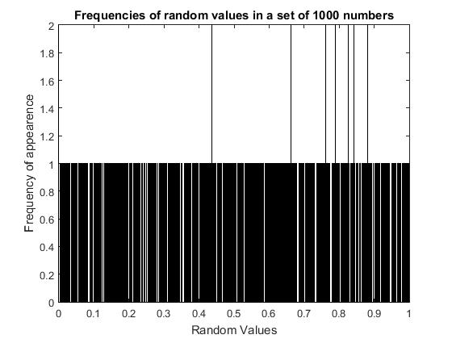
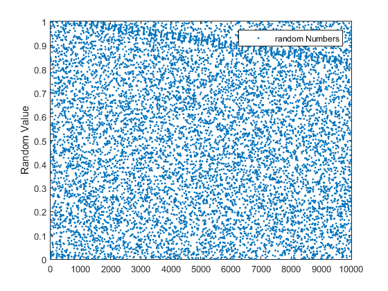

# Pseudo-Random Number Generation in Fortran and Visualization in MATLAB

In this repository, you'll find Fortran implementations for two pseudo-random number generation methods: Park and Miller’s minimal standard method, and L’Ecuyer’s combined method. Visualization of the uniformity and randomness of these numbers is performed in MATLAB.

## Implemented Methods

- **Park and Miller’s Method (Minimal Standard)**
- **L’Ecuyer’s Combined Method**

## Visualizing the Uniformity of Generated Numbers

To visualize the uniformity of the numbers generated by these methods, a sample of 10,000 pseudo-random numbers has been generated. These numbers have been exported and visualized in MATLAB.

The graph illustrates the uniform distribution of these numbers.

## Measuring Randomness

The randomness of the generated numbers is measured using various tests:

- **Chi-Square Test**
- **Order Pair Test**
- **Sample Mean and Sample Variance**
- **Chi-Squared Test**

These tests help evaluate the quality and randomness of the generated numbers.

## Repository Structure

- `/fortran`: Contains the Fortran implementations.
- `/matlab`: Contains MATLAB scripts for visualizing the generated numbers and performing randomness tests.

---

Explore the implementations, visualizations, and tests to better understand the uniformity and randomness of these pseudo-random number generation methods!

---

¡Explora las implementaciones, visualizaciones y tests para entender mejor la uniformidad y aleatoriedad de estos métodos de generación de números pseudoaleatorios!

